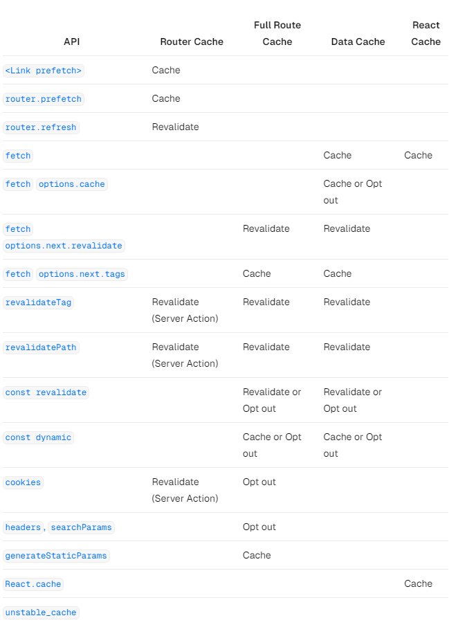

# 캐싱

- Next.js는 렌더링과 데이터 로딩을 캐싱해서 성능을 개선함

<br/>

# 미리보기

- 다양한 캐싱 매커니즘과 그 목적에 대한 내용임

| 매커니즘         | 무엇을                 | 언제       | 목적                                 | 얼마동안                 |
| ---------------- | ---------------------- | ---------- | ------------------------------------ | ------------------------ |
| 요청 캐싱        | 함수에서 값을 반환할때 | 서버       | 리액트 컴포넌트 트리에서 값을 재사용 | 1개의 요청당             |
| 데이터 캐싱      | 데이터                 | 서버       | 유저의 요청과 배포 전반에 걸쳐서     | 영속성(갱신가능)         |
| 라우터 전체 캐싱 | HTML, RSC Payload      | 서버       | 렌더링 비용을 줄이고 최적화를 위함   | 영속성(갱신가능)         |
| 라우터 캐시      | RSC Payload            | 클라이언트 | 탐색시 서버 요청 최소화              | 유저의 세션이나 시간기반 |

- 기본적으로 성능을 개선하고 비용을 절감하기 위해서 최대한 캐싱함
- 사용자가 기타 조치를 하지 않으면 경로가 정적으로 렌더링되고 데이터 요청이 캐싱됨
- 아래 다이어그램은 빌드시 라우터가 정적으로 렌더링 되는 경우와 정적 경로가 처음 방문되는 경우 기본 캐싱 동작임


캐싱 동작은 아래 상황에 따라 달라짐  
상황에 따라서 개별 경로 및 데이터 요청에 대한 캐싱동작 구현이 가능함

1. 경로가 정적으로 또는 동적으로 렌더링 되는지
2. 데이터가 캐시되는지 안되는지
3. 요청이 초기 방문의 일부인지 후속 탐색의 일부인지

<br/>

# 요청 캐싱

- URL과 옵션이 동일한 요청을 자동으로 캐싱하도록 fetch를 확장함
- 컴포넌트 트리의 여러 위치에서 동일한 데이터에 대한 fetch 함수를 한번만 실행하면서 호출이 가능함


- 레이아웃, 페이지, 여러 컴포넌트 등 에서 동일한 데이터를 사용하는 경우 최상단에서 데이터를 가져오거나 props를 사용하지 않아도 됨
- 이러한 특성으로 인해 네트워크 요청에 대한 부담 없이 필요한 컴포넌트에서 데이터를 가져올 수 있음

```tsx
async function getItem() {
  // fetch 함수는 요청에 대한 응답을 자동으로 캐싱함
  const res = await fetch("https://.../item/1");
  return res.json();
}

// getItem() 함수는 총 2번 호출하지만 아직 호출하지 않았음
const item = await getItem(); // cache MISS

const item = await getItem(); // cache HIT
```

<br/>

#### 요청 캐싱의 원리


1. 맨 처음 렌더링할때 특정 요청이 호출되면 해당 결과는 메모리에 저장되고 캐시 미스가 발생함
2. 그리고나서 함수가 실행되고 외부 소스에서 데이터를 가져오고 그 결과가 메모리에 저장됨
3. 동일한 렌더링 경로에서 요청의 후속 함수는 캐시 HIT가 발생하고 데이터는 함수를 실행하지 않고 메모리에서 바로 반환됨
4. 전체 렌더링 과정이 끝나면 렌더링 사이클에 사용된 임시 메모리 상태는 초기화됨, 즉 캐싱된 항목이 제거됨

<br/>

# 캐싱되는 기간

- 캐시는 컴포넌트 트리가 렌더링을 완료할 떄 까지 서버의 라이프사이클 시간동안 지속됨

<br/>

# 갱신

- 캐싱은 서버요청간 공유하지 않고 렌더링 중에만 적용되므로 갱신을 안해도됨

<br/>

# 캐싱 해제

- 캐싱을 해제하면 GET 요청에만 적용되고 다른 HTTP METHOD에는 적용되지 않음
- 해당 동작은 기본적으로 최적화를 위함이니 해제하지 않는게 좋음
- 개별 요청을 관리할려면 AbortController의 signal을 사용하는게 좋음
- 하지만 이건 캐싱을 해제하는게 아니라 현재 진행중인 네트워크 요청을 취소하는것임

```tsx
const { signal } = new AbortController();
fetch(url, { signal });
```

<br/>

# 데이터 캐싱

- Next.js에는 서버 요청과 배포시 데이터 조회 결과를 캐싱하는 기능이 내장되어 있다
- fetch를 확장하여 서버의 각 요청이 자체적인 영구 캐싱을 설정할수 있기 떄문이다
- 기본적으로 fetch를 사용하는 데이터 조회 요청은 모두 캐싱된다
- cache 또는 next.revalidate를 사용해서 캐싱 동작을 커스텀 가능하다

### 데이터 캐싱 동작원리


1. 맨 처음 fetch를 통한 데이터 호출이 발생하면 캐싱된 데이터가 있는지 확인함
2. 만약 캐싱된 데이터가 있다면 바로 반환함
3. 만약 캐싱된 데이터가 없다면 실제 요청이 이루어지고 캐싱됨
4. 만약 `{cache: 'no-store'}`등 캐싱하지 않으면 항상 새로운 요청이 발생함
5. 데이터가 캐싱되든 안되는 요청은 항상 캐싱되어 렌더링 과정에서 동일한 데이터에 대한 중복요청을 피할 수 있음

<br/>

### 데이터 캐싱과 요청 캐싱의 차이

- 데이터 캐시는 데이터 요청과 배포에 걸쳐서 수행됨
- 요청 캐싱은 렌더링 라이프사이클에서만 유지됨

<br/>

### 데이터 캐싱 주기

- 데이터를 직접 갱신하거나 끄지 않는이상 영구적으로 유지됨

<br/>

### 갱신

#### 시간 기반 갱신

- 지정한 시간이 지나면 저장된 캐시 데이터를 삭제하는 방법
- 데이터의 변동이 없고 실시간성 데이터가 아닌 경우 유용함
- 시간 기반으로 데이터를 갱신할려고 할때는 `next.revalidate` 옵션이나 fetch에다가 시간을 지정한다

```tsx
// 1시간마다 캐시를 갱신하기
fetch("https://...", { next: { revalidate: 3600 } });
```

<br/>

#### 시간 기반 갱신의 동작원리


1. 우선 외부에서 데이터를 가져와서 데이터 캐시에 저장함
2. 지정된 시간동안 동일한 요청이 발생하면 캐싱된 데이터를 반환함
3. 시간이 만료되면 새롭게 데이터를 가져오고 다시 캐싱함
4. next.js는 백그라운드에서 revalidation 시간에 대해서 트리거함

<br/>

#### 요청에 의한 갱신

- `revalidatePath` 또는 `revalidateTag`에 의해서 갱신됨

<br/>

#### 요청에 의한 갱신 동작원리

1. 우선 외부에서 데이터를 가져와서 데이터 캐시에 저장함
2. 재검증이 트리거되면 해당 캐시 항목이 캐시에서 삭제됨
3. 이건 시간 기반 갱신과 다르게 재검증이 트리거되지 않으면 무한으로 지속됨

<br/>

### 캐싱 해제

- fetch의 cache 옵션에 no-store를 지정해서 캐싱 해제가 가능함

```tsx
// 캐싱 미적용
fetch(`https://...`, { cache: "no-store" });
```

<br/>

# 전체 경로 캐싱

- Next.js는 빌드시점에 렌더링과 경로에 대해서 자동으로 캐싱함
- 최적화를 통해서 서버에서 직접 렌더링 하는 대신 캐시된 경로를 통해서 로딩속도를 높일 수 있음
- 전체 경로 캐싱에 대해서 이해할려면 React에서 렌더링 처리 방식과 Next.js가 결과를 캐싱하는 방식에 대해서 알아야함

### 1. 서버에서 리액트 렌더링

- 서버에서 Next.js는 리액트 API를 사용해서 렌더링을 처리함
- 렌더링 작업은 개별 경로와 Suspense 경계에 따라서 청크로 나눠짐
- 각 청크는 아래 2개의 단계로 렌더링됨
  - 리액트는 RSC Payload를 사용해서 스트리밍을 최적화함
  - Next.js는 RSC Payload랑 클라이언트 컴포넌트의 JS를 사용해서 서버에서 HTML을 렌더링함
- 즉 작업을 캐싱하거나 응답하기전에 모든 렌더링 과정을 기다릴 필요가 없음. 작업이 완료되면 바로 스트리밍함

<br/>

### 2. Next.js가 서버에서 캐싱하는 방법(모든 경로 캐싱)


- 기본 캐싱 동작은 서버에서 렌더링된 결과를 캐싱하는거임

<br/>

### 3. 리액트가 클라이언트에서 Hydration 하는법

- 클라/서버 컴포넌트에 의해서 정적인 HTML 미리보기를 렌더링함
- 서버 컴포넌트가 RSC Payload를 가지고 서버 컴포넌트 트리와 DOM을 업데이트
- 클라이언트 컴포넌트에서 JS를 사용하여 Hydration 진행, 대화형 UI로 바뀜

<br/>

### 4. Next.js가 클라이언트에서 캐싱하는법(경로 캐싱)

- RSC Payload는 클라이언트 사이드의 메모리에 캐싱됨
- 라우터 캐시는 이전에 방문했던 정보를 저장하고 향후 경로를 미리 가져와서 최적화함

<br/>

### 5. 후속 탐색

1. 후속 탐색이나 prefetch 중에 Next.js는 RSC Paylaod가 라우터 캐시에 있는지 확인함
2. 만약 캐시가 존재하면 서버에 새로운 요청을 보내는것을 패스함
3. 캐시가 없다면 서버에서 RSC Payload를 가져와서 클라이언트의 라우터 캐시를 저장함

<br/>

### 동적 및 정적 렌더링

- 빌드 시 해당 경로가 캐싱되는 여부는 정적인지 동적인지에 따라서 달라짐
- 정적 경로는 기본적으로 캐싱되지만, 동적 경로는 요청 시 렌더링되고 미리 캐싱되지 않음


<br/>

### 캐싱 주기

- 기본적으로 정적 경로에 대해서는 영구적임
- 이 뜻은 유저에게 캐싱된 결과물을 렌더링함

<br/>

### 캐시 무효화

#### 데이터 갱신

- 캐시를 갱신하는 경우 서버에서 컴포넌트를 다시 렌더링하고, 새로운 렌더링된 결과를 캐싱한다

#### 재배포

- 배포간 유지되는 데이터 캐시와 다르게 모든 경로에 대한 캐시는 새로운 배포에서 삭제됨

<br/>

### 캐시 비활성화

- 전체 경로 캐싱은 비활성화가 가능하다

#### 동적 함수 사용하기

- 동적 함수를 사용하면 요청 시점에 동적으로 렌더링함
- 데이터 캐시는 계속 사용이 가능함

#### `dynamic='force-dynamic' or `relidate=0` 사용하기

- 위 옵션을 사용하면 전체 경로와 데이터 캐싱이 비활성화 된다
- 이 뜻은 컴포넌트가 요청시마다 새로운 데이터를 매번 가져오고 렌더링 된다
- 라우터 캐시는 클라이언트 사이드에서는 여전히 캐싱된다

#### Data Cache 비활성화

- 특정 경로에 캐싱되지 않는 fetch가 있는 경우 해당 경로를 전체 경로 캐싱에서 제외
- 이렇게 되면 매번 요청마다 fetch 요청이 새로운 데이터를 로딩한다
- 캐싱을 비활성화 하지 않은 다른 fetch 요청은 여전히 데이터 캐싱에 사용됨
- 이러면 캐시된 데이터랑 캐싱이 안된 데이터를 혼합해서 사용이 가능함

<br/>

# 경로 캐시

- Next.js에는 유저의 세션이 진행되는 동안 클라이언 측 메모리에 RSC Payload를 캐싱한다. 이것이 경로 캐싱이다


- 유저가 웹사이트를 탐색하면 방문한 경로를 캐싱하고, 탐색할 가능성이 높은 경로를 미리 캐싱함
- 가능성이 높은건 viewport의 `<Link>` 를 기반으로함
- 방문한 경로가 캐싱되므로 앞/뒤 탐색에 또 로딩하지 않아 UX가 향상됨
- 탐색간에 페이지를 다시 로드하지 않고 React State와 브라우저 State가 보존됨

### 캐싱 주기

- 경로 캐시의 경우 브라우저의 메모리에 캐싱됨

#### 세션

- 캐시는 모든 탐색 전반에 걸쳐서 유지됨
- 하지만 새로고침을 하게되면 캐시가 지워짐

#### 자동 무효화

- 특정 시간이 지나면 캐시가 자동으로 무효화됨
- 캐싱되는 시간은 prefetch 방식에 따라서 다름
- 기본 prefetch(`prefetch={null}`)의 경우 30초 동안 캐싱됨
- 전체 prefetch(`prefetch={true}` or `route.prefetch`)의 경우 5분 동안 캐싱됨

페이지를 새로고침 하면 캐싱된 모든 값을 지우지면 자동 무효과 기간은 미리 가져온 시점부터 개별 세그먼트로 관리됨

<br/>

### 캐시 갱신

- 서버 액션
  - revalidatePath or revalidateTag에 의해서 갱신됨
  - cookies.set or cookies.delete를 하게되면 갱신됨
  - router.refresh을 호출하면 캐시가 갱신되고 현재 경로에 대한 새로운 요청이 서버로 전송됨

<br/>

### 캐시 비활성화

- 우선 경로 캐싱은 비활성화 불가능함
- 하지만 router.refresh, revalidatePath 등 을 사용해서 무효화가 가능함
- 캐시가 지워지고 새로운 요청을 전송해서 최신 데이터가 표시되도록함
- `<Link>` 태그에 prefetch={false}를 통해서 prefetch 비활성화가 가능함

하지만 비활성화를 하더라도 기본값으로 30초 동안은 캐싱을 하게됨

<br/>

# 캐시 인터렉션

- 다양한 캐싱 전략을 세울때는 어떻게 서로 상호작용이 이루어지는지 일아야함

### 데이터 캐시와 전체 경로 캐싱

- 렌더링의 경우 데이터에 따라서 달라지게됨
- 캐시를 갱신하거나 데이터 캐시를 해제하면 전체 경로 캐시가 무효화됨
- 전체 경로에 대한 캐싱을 무효화해도 데이터 캐시에는 영향을 미치지 않음
- 캐시된 데이터와 캐싱이 안된 데이터를 모두 포함된 경로를 동적으로 렌더링이 가능
- 대부분의 페이지는 캐싱된 데이터를 사용하지만 요청 시점에 데이터를 새로 가져와야하는 경우 유용함
- 모든 데이터를 다시 가져올때는 성능에 대해서 걱정하지 않고 동적으로 렌더링 가능함

### 데이터 캐시와 클라이언트 사이드 라우터 캐시

- 라우터 핸들러의 경우 따로 연결되있는게 아니라서 데이터 캐시를 갱신해도 라우터 캐시가 즉시 무효화되진 않음
- 라우터 캐시는 새로고침이나 자동 무효화 시간이 경과할떄 까지는 이전 페이로드를 계속 제공하게됨
- 서버액션에서 데이터 캐시나 라우터 캐시를 즉시 무효화 할려면 revalidatePath 또는 revalidateTag를 사용해야함

<br/>

# 캐싱에 영향을 끼치는 API 목록



### `<Link>`

- 기본적으로 `<Link>` 는 전체 경로 캐시에서 경로를 자동으로 prefetch 하고 RSC Payload를 추가함
- prefetch 사용을 비활성화 할려면 `prefetch={false}`를 설정함
- 하지만 캐싱이 비활성화 되진 않음. 유저가 특정 경로를 방문하면 클라이언트 사이드에 캐싱됨

<br/>

### `router.prefetch`

- router.prefetch를 사용해서 특정 경로를 수동으로 prefetch가 가능함
- 이렇게 하게되면 라우터 캐시에 RSC Payload가 추가됨

<br/>

### `router.refresh`

- router.refresh를 하게되면 경로를 수동으로 새로고침이 가능함
- 이렇게 하게되면 캐시가 완전히 지워지고 현재 경로에 대해서 서버에 재요청을 진행함
- 새로고침은 데이터나 전체 경로 캐시에는 영향을 주지 않음
- 렌더링된 결과는 React State, Browser State를 유지함

<br/>

### `fetch`

- fetch를 통해서 반환되는 데이터는 데이터 캐시에 자동으로 캐싱됨

```tsx
// 기본적으로 fetch는 캐싱됨, 기본값은 force-cache임
fetch(`https://...`, { cache: "force-cache" });
```

<br/>

### `fetch options.cache`

- 예를 들어서 `{cache: 'no-store'}` 를 사용해서 캐싱 비활성화가 가능함

```tsx
// 캐싱 비활성화, 서버에 매번 재요청이 들어감
fetch(`https://...`, { cache: "no-store" });
```

렌더링은 데이터에 따라서 달라지게 되므로 캐싱을 비활성화 하면 fetch 요청에 대한 전체 경로 캐시도 무시됨

요청이 있을 때 마다 경로가 동적으로 렌더링 되지만 동일한 경로에 다른 캐시된 데이터 요청이 계속 발생할수도 있음

<br/>

### `fetch options.next.tags` 및 `revalidateTag`

- Next.js는 세분화된 캐싱 밎 갱신을 위한 캐시 태깅 시스템이 존재함
- fetch 또는 unstable_cache를 사용할때 하나 이사으이 태그로 캐시 항목에 태깅이 가능함
- revalidateTag를 하게되면 해당 태그와 연관된 캐싱이 모두 초기화됨

```tsx
// 태그로 데이터 캐싱하기
fetch(`https://...`, { next: { tags: ["a", "b", "c"] } });
```

```tsx
// a 태그의 데이터 캐싱 무효화
revalidateTag("a");
```

revalidateTag는 두가지 위치에서 사용이 가능함

- 라우트 핸들러 : 웹훅 등 다른 이벤트에 대한 응답으로 데이터 재검증이 가능함. 라우터 핸들러는 특정 경로에 연결되어있지 않아서 라우터 캐시가 즉시 지워지지 않음
- 서버 액션 : form submit 등 이후에 데이터의 유효성 재검증이 가능함. 연결된 경로에 대한 라우터 캐시가 무효화됨

<br/>

### `revalidatePath`

- 한번의 작업으로 데이터를 수동으로 재검증하고 특정 경로 아래의 컴포넌트를 다시 렌더링 할 수 있음
- revalidatePath 함수를 호출하면 데이터 캐시의 유효성이 재검증되고 전체 경로 캐시가 무효화됨

```tsx
revalidatePath("/");
```

revalidatePath는 두가지 위치에서 사용이 가능함

- 라우트 핸들러 : 웹훅 등 다른 이벤트에 대한 응답으로 데이터를 재검증
- 서버 액션 : form submit, 버튼 클릭 등 후에 데이터를 재검증

<br/>

### 동적 함수

- cookies, headers, searchParams 동적 함수의 경우 런타임에 request 정보에 따라서 달라짐
- 이런 함수를 사용하게되면 동적으로 렌더링됨

<br/>

# 캐싱 관련 계속 다루던 내용이라 생략
